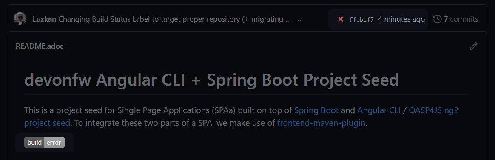

<br />
<p align="center">
  <h2 align="center">Design & Implementation of Web Systems</h2>
  <h3 align="center">Task List #1</h3>
  <p align="center">
    <a href="./README.md"><strong>README.md</strong></a>
    ·
    <a href="./Tasklist1.pdf">Tasklist1.pdf</a>
    ·
    <a href="https://luzkan.github.io/DesignAndImplementationOfWebSystems/Tasklist1/index.html">Website</a>
  </p>
</p>


<details open="open">
  <summary>Tasks & Summary</summary>
  <ol>
    <li>
      <a href="#task-1">Task #1</a>
      <ul>
        <li>Configure SSH access for your github profile.</li>
        <li><a href="#generating-pair-of-keys">Generating pair of keys</a></li>
        <li><a href="#adding-key-to-ssh-agent">Adding key to ssh-agent</a></li>
        <li><a href="#adding-public-key-to-github-profile">Adding public key to github profile</a></li>
      </ul>
    </li>
    <li>
      <a href="#task-2">Task #2</a>
      <ul>
        <li>Working with local copy of a repository.</li>
        <li><a href="#creating-new-repository">Creating new repository</a></li>
        <li><a href="#pulling-contents-from-another-repository-into-previously-created-local-one">Pulling contents from another repository into previously created local one</a></li>
        <li><a href="#modifying-contents-of">Modifying contents of README.adoc & Pushing it to remote</a></li>
      </ul>
    </li>
    <li>
      <a href="#task-3">Task #3</a>
      <ul>
        <li>Working with branches and pull requests.</li>
      </ul>
    </li>
    <li><a href="#task-4">Task #4</a>
      <ul>
        <li>Tidying up history.</li>
      </ul>
    </li>
    <li><a href="#task-5">Task #5</a>
      <ul>
        <li>Configuring Continuous Integration.</li>
      </ul>
    </li>
    <li><a href="#task-6">Task #6</a>
      <ul>
        <li>Preparing Working Environment with Maven.</li>
      </ul>
    </li>
  </ol>
</details>

---

## Task #1
<details>
  <summary>Configure SSH access for your github profile.</summary>

---

### Generating pair of keys
##### RSA is completely fine as it's secure above length of 2048 bits (flag: `-b 4096`), although `ed25519` is a good alternative because it is smaller and more performant (at least according to [gitlab](https://docs.gitlab.com/ee/ssh/README.html#ed25519-ssh-keys)).
```console
$ ssh-keygen -t ed25519 -C "wellheregoesmyemail@obviously.com"
```

### Adding key to ssh-agent
##### Creating new file
```console
$ eval `ssh-agent -s`  # Start SSH Agent Process
  > Agent pid 2010
$ ssh-add C:\\Users\\Luzkan\\.ssh\\github_key
  > Identity added: C:\Users\Luzkan\.ssh\github_key (wellheregoesmyemail@obviously.com)
```

### Adding public key to github profile
```console
$ clip < ~/.ssh/github_key.pub  # Copies the public key
```
##### Navigating to: Settings -> SSH & GPG Keys -> New SSH key


##### After inserting previously copied key and adding it


</details>

## Task #2
<details>
  <summary>Working with local copy of a repository.</summary>

---

### Creating new repository
##### Simply clicking the button on github


##### Right after cloning the initialized remote repository
```console
$ git clone https://github.com/Luzkan/Design-Implementation-of-Web-Systems.git
```

### Pulling contents from another repository into previously created local one
##### I'm unsure if the task wants to copy only the contents or with whole commit history. To keep things tidy, I decided to go for content-copy ("zawartość"). Pushing to remote.


### Adding read/write access for lecturer
##### Added contributors of previously fetched for contents remote repository


### Modifying contents of README.adoc & Pushing it to remote
##### Added a line suggesting using AsciiDoc extension in order to display .adoc file in VSC and then:
```console
$ git add .
$ git commit -m "Added suggestion: how to display .adoc file... in adoc file"
$ git push
```

</details>

## Task #3
<details>
  <summary>Working with branches and pull requests.</summary>

---

##### Creating new branch and checkout
```console
$ git checkout -b feature_foo
```

##### Creating file `trigger.txt` so I'm able to commit something. Committing and pushing branch to remote.

```console
$ git commit -m "Feature Foo Added"
$ git push
```

##### Creating a change on `master` branch. Checkout and doing something similar.
```console
$ git checkout master
  # <creating hotfix.txt>
$ git add .
$ git commit -m "Important Hotfix for goo"
$ git push
```

##### Creating Merge Request (Pull Request)


</details>

## Task #4
<details>
  <summary>Tidying up history.</summary>

---

##### Creating new branch and checkout (again)
```console
$ git pull
$ git checkout -b fix_woo
```

##### Creating three new commits on new branch

```console
  # <making changes>
$ git commit -m "Fix Commit #1"
  # <making changes>
$ git commit -m "Fix Commit #2"
  # <making changes>
$ git commit -m "Fix Commit #3"
$ git push
```

##### It's time to merge changes locally to master branch and then pushing it to remote. Task wants to squash previous commits into one before the merge. My preferred way would be to simply `git rebase -i HEAD~3` on our local branch, as the three commits - if needed - are available on remote.
```console
$ git rebase -i HEAD~3
  # comment out previous commit messages and make a new one (or keep the last, w/e)>
  # tip: "i" - for interactive mode | "ESC" and ":wq" to save and quit
$ git log --oneline
  > 7d15a2e (HEAD -> fix_woo) Fix Woo
  > 5841c66 (origin/master, master) Feature Foo Added
$ git checkout master
$ git rebase fix_woo
  > Successfully rebased and updated refs/heads/master.
$ git log --oneline
  > 7d15a2e (HEAD -> master, fix_woo) Fix Woo
  > 5841c66 (origin/master) Feature Foo Added
$ git push
```

</details>

## Task #5
<details>
  <summary>Configuring Continuous Integration.</summary>

---

##### Created a new account using github registration option on [circleci.com](https://circleci.com). Activated the environment for development repository and ran first build.


##### It is properly integrated with github


##### Triggering pipeline CI via committing changes to remote repository.


##### Change build status label to target proper repository and migrated from Travis `.org` website as it will be shutting down in several weeks (_@todays-date: 26.02.2021_) to `.com`.


##### Verifying that everything is working correctly.


</details>

## Task #6
<details open>
  <summary>Preparing Working Environment</summary>

---

##### Creating new directory for configuration files


##### Adding Maven commands


##### `pom.xml`


</details>