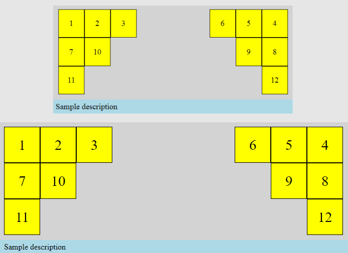
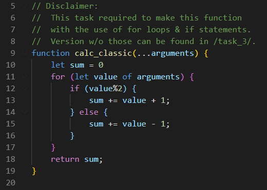
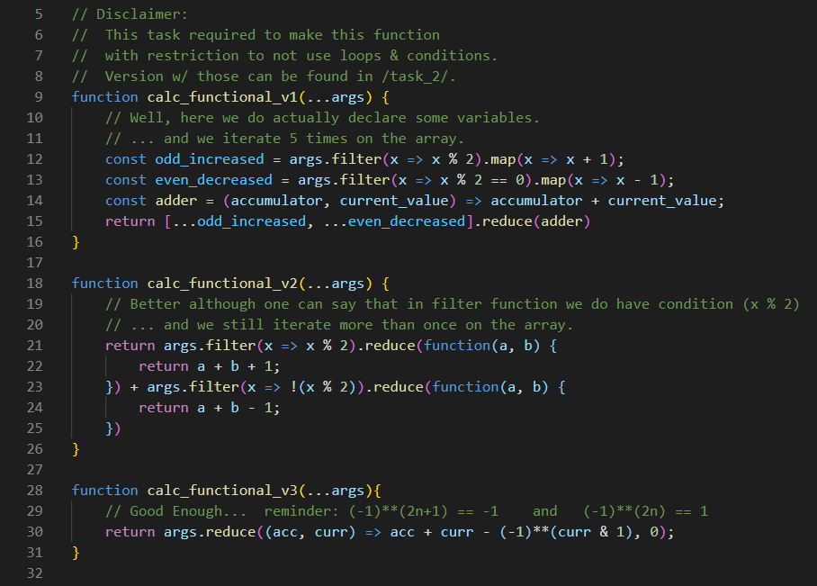

  <h2 align="center">Design & Implementation of Web Systems</h2>
  <h3 align="center">Task List #2</h3>
  

    <a href="./README.md"><strong>README.md</strong></a>
    ·
    <a href="./Tasklist2.pdf">Tasklist2.pdf</a>
    ·
    <a href="https://luzkan.github.io/DesignAndImplementationOfWebSystems/Tasklist2/index.html">Website</a>
  

  
Tasks & Summary

  <ol>
    <li>
      <a href="#task-1">Task #1</a>
      <i>(<a href="https://luzkan.github.io/DesignAndImplementationOfWebSystems/Tasklist2/task_1/index.html">site</a>)</i>
      <ul>
        <li>Styling HTML document with CSS to match design.</li>
      </ul>
    </li>
    <li>
      <a href="#task-2">Task #2</a>
      <i>(<a href="https://luzkan.github.io/DesignAndImplementationOfWebSystems/Tasklist2/task_2/index.html">site</a>)</i>
      <ul>
        <li>JavaScript summing function (classic).</li>
      </ul>
    </li>
    <li>
      <a href="#task-3">Task #3</a>
      <i>(<a href="https://luzkan.github.io/DesignAndImplementationOfWebSystems/Tasklist2/task_3/index.html">site</a>)</i>
      <ul>
        <li>JavaScript summing function without for loops, conditionals and variable declarations (functional).</li>
      </ul>
    </li>
    <li>
      <a href="#task-4">Task #4</a>
      <i>(<a href="https://luzkan.github.io/DesignAndImplementationOfWebSystems/Tasklist2/task_4/index.html">site</a>)</i>
      <ul>
        <li>Factory Method in JavaScript.</li>
      </ul>
    </li>
  </ol>

---

## Task #1

  
Styling HTML document with CSS to match design.

---

### __Code in `/task_1/`: [index.html](./task_1/index.html) & [main.css](./task_1/main.css)__
##### Comparison of design (top) and implementation (bottom).

## Task #2

  
JavaScript summing function (classic).

---

### __Code in `/task_2/`: [index.html](./task_2/index.html) & [main.js](./task_2/main.js)__
##### Simply clicking the button on github

##### Core of the final answer to the task

## Task #3

  
JavaScript summing function without for loops, conditionals and variable declarations (functional).

---

### __Code in `/task_3/`: [index.html](./task_3/index.html) & [main.js](./task_3/main.js)__
##### Simply clicking the button on github

##### Core of the final answer to the task

## Task #4

  
Factory Method in JavaScript.

---

### __Code in `/task_4/`: [index.html](./task_4/index.html) & [account.js](./task_4/js/account.js) + [main.js](./task_4/js/main.js) __
##### Features creation of new objects & balance manipulation + info button.

