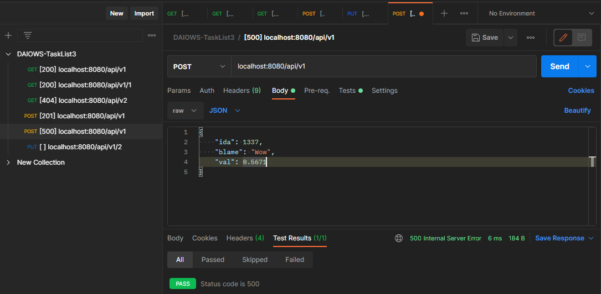
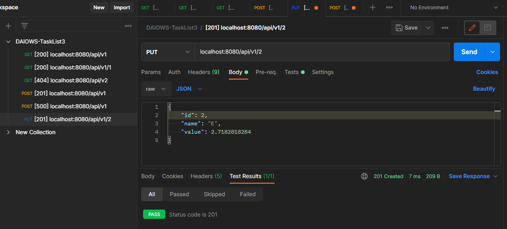

  <h2 align="center">Design & Implementation of Web Systems</h2>
  <h3 align="center">Task List #3</h3>
  

    <a href="./README.md"><strong>README.md</strong></a>
    ·
    <a href="./Tasklist3.pdf">Tasklist3.pdf</a>
    ·
    <a href="https://luzkan.github.io/DesignAndImplementationOfWebSystems/Tasklist3/index.html">Website</a>
  

  
Tasks & Summary

  <ol>
    <li>
      <a href="#task-1">Task #1</a>
      <i>(Create Reverse Proxy)</i>
      <ul>
        <li>Create in/out interfaces that take request and depending of the method of the request -> sends them further to one of three systems.</li>
        <li>Because the systems are inexistent - create mock answers.</li>
        <li>Make use of <i>application.properties</i> for configurations.</li>
      </ul>
    </li>
    <li>
      <a href="#task-2">Task #2</a>
      <i>(Automatic Tests)</i>
      <ul>
        <li>For each type of request create at least one automatic test.</li>
        <li>Additionally created tests for MockDataSource & Boot Test.</li>
      </ul>
    </li>
    <li>
      <a href="#task-3">Task #3</a>
      <i>(Exceptions Handling)</i>
      <ul>
        <li>Reverse Proxy does not interpret the exceptions that could happen when communicating with external systems. These errors should be passed further.</li>
        <li>Should make use of <i>ControllerAdvice</i>.</li>
      </ul>
    </li>
    <li>
    <a href="#task-4">Task #4</a>
      <i>(Integration Tests)</i>
      <ul>
        <li>For each request there should be at least two integrations tests (one <i>happy path</i> and one negative one).</li>
        <li>Should make use of <i>Postman</i>.</li>
      </ul>
    </li>
        <li>
    <a href="#task-5">Task #5</a>
      <i>(CircleCI)</i>
      <ul>
        <li>Integrate Repository with CircleCI and make sure that the application is building and tests are passing.</li>
        <li>Repository status should be <i>Green</i>.</li>
      </ul>
    </li>
  </ol>

---

## Task #1

  
Create Reverse Proxy.

---

### Initializing new project with Spring Initializer
##### Checking Maven & Spring Web Dependency (with Kotlin Language). Java 11 which will be also used later in Task #5 in CircleCI.

### Structuring the project
##### Obviously we need a `Controller` class for our Proxy. `Datasource` that could be expanded on further with split between mock and network/systems. So does `model` have it's own directory and service that handles requests and passes them further. Exception Handler has it's own directory as it was suggested in the task.

### ProxyController
##### Implements global `get` to retrieve everything, specific `get` to get item by id, `post` & `put`.

### Foo (Model)
##### The Model itself already uses `JsonProperties` for extendability and usage - it is the main and most used type of data transferred over HTTP Requests.

### Foo (DataSource & DTO)
##### The interface for Foo (`get` [all], `get` [one], `post` [one], `put` [one])

### SystemDataSource
##### Class which will create expected calls to given systems. It's a `TODO` work as they are not implemented. On the picture - some placeholder functions that need to be finished & values gathered from `application.properties`.

### MockFooDataSource
##### Class used to test the implementation of '_everything yet_'. A bit of mocked values for previously created random Foo object and implementation of mocked functionalities.

## Task #2

  
Automatic Tests.

---

### Test Proxy Class
##### Using [MockMVC](https://docs.spring.io/spring-framework/docs/current/javadoc-api/org/springframework/test/web/servlet/MockMvc.html). By the way - base url is `/api/v1` as that's the convention for any REST api's (we can simply flip version number in case of updates, so we can still easily support older versions).

##### Testing `GET` [all]

##### Testing `GET` [one]

##### Testing `POST` [one]

##### Testing `PUT` [one]

### Tests Results

### Additional Tests for the Mocked DataSource

### Boot Test

## Task #3

  
Exceptions Handling.

---

### Exceptions Handling
##### ExceptionHandler class & ControllerAdvice w/ some few custom messages. Could use `e.message` as well for the body.

## Task #4

  
Integration Tests.

---

### Trying out Postman for the first time.
##### Executing the `GET` [All] on `/api/v1`

### Testing `GET`
##### Proper `GET` [One] Request

##### Failing `GET` [One] Request - Getting inexistent element

### Testing `POST`
##### Proper `POST` Request

##### Failing `POST` Request - Wrong key names *(could implement handler for that JSONParseException)*.

### Testing `PUT`
##### Proper `PUT` Request

##### Failing `PUT` Request - Path & ID mismatch.

## Task #5

  
CircleCI.

---

### Initializing Pipeline in CircleCI
##### Using Version `2.1` which allows for usage of orbs. Using maven orb `maven@1.1.1` and running `maven/test`.

##### All checks passed.

##### Tests were detected and ran properly.

##### Merging in CircleCI config to master branch.

##### CircleCI is working properly.

