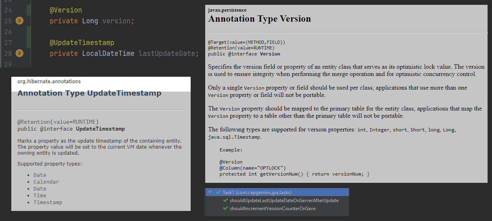
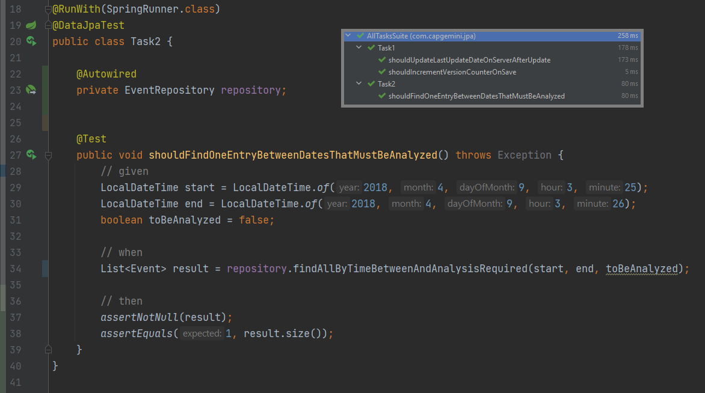
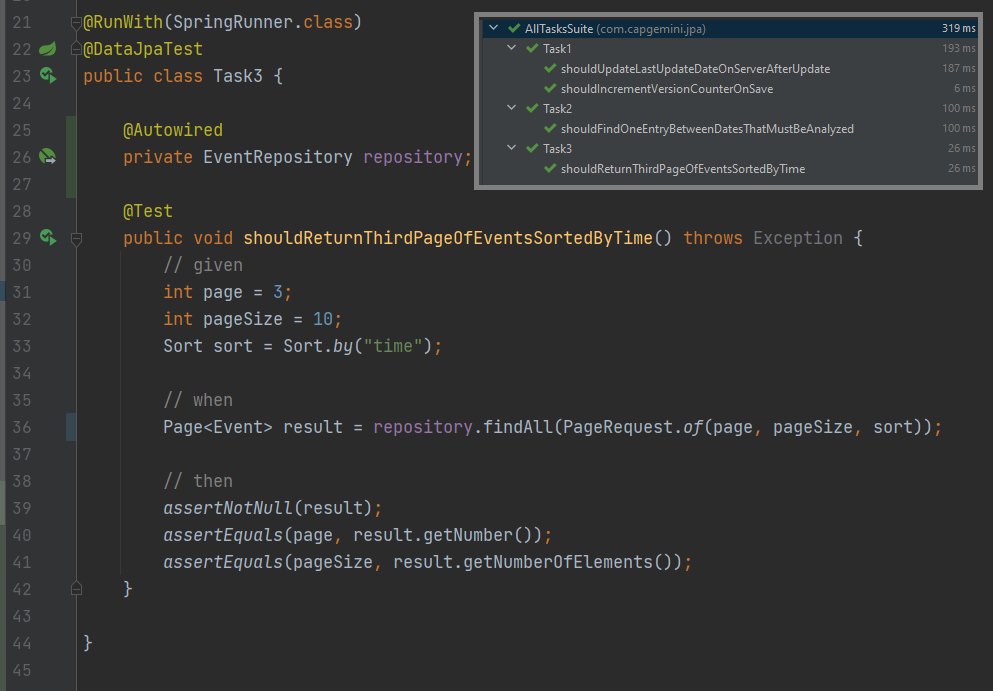
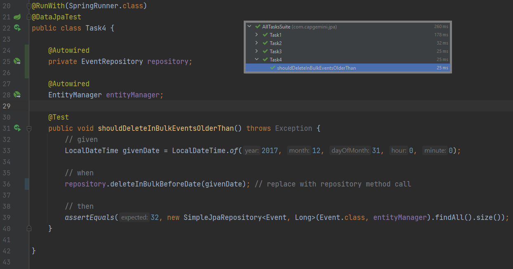
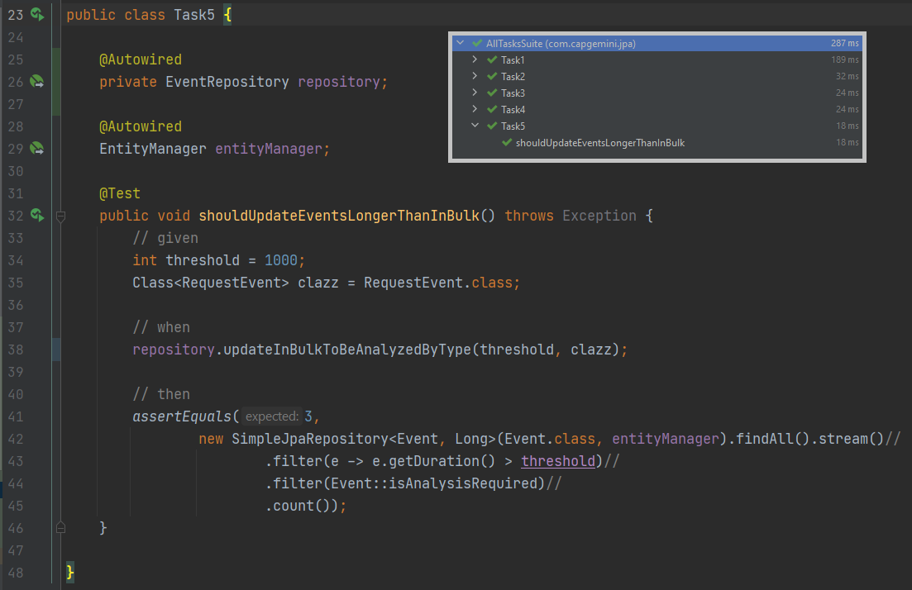
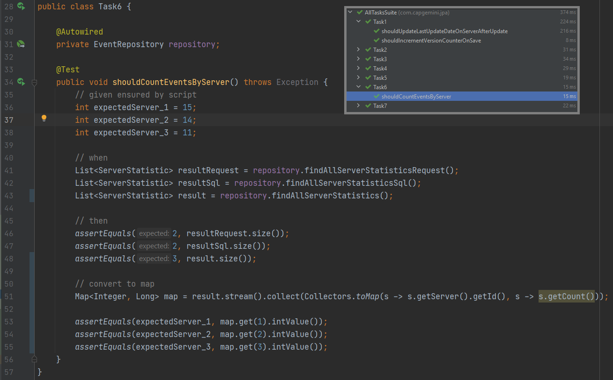
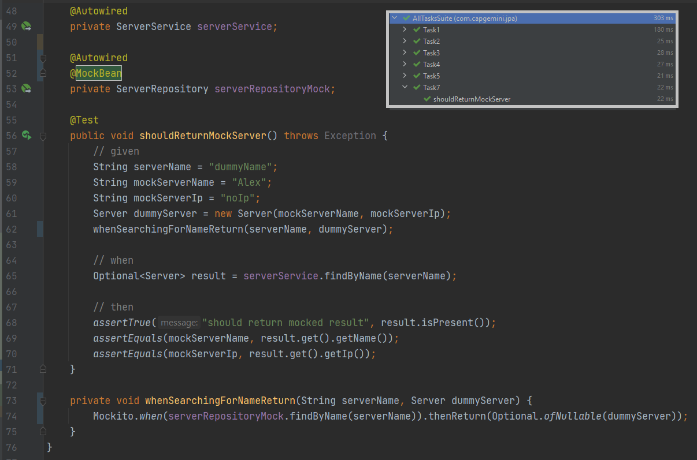

<p align="center">
  <h2 align="center">Design & Implementation of Web Systems</h2>
  <h3 align="center">Task List #4</h3>
  <p align="center">
    <a href="./README.md"><strong>README.md</strong></a>
    ·
    <a href="./Tasklist4.pdf">Tasklist4.pdf</a>
    ·
    <a href="https://luzkan.github.io/DesignAndImplementationOfWebSystems/Tasklist4/index.html">Website</a>
  </p>
</p>

<details open>
  <summary>Tasks & Summary</summary>
  <ol>
    <li>
      <a href="#task-1">Task #1</a>
      <i>Increment Version & Put Current DateTime when Entity is Modified</i>
    </li>
    <li>
      <a href="#task-2">Task #2</a>
      <i>Extending JPA Repository & Creating Query</i>
    </li>
    <li>
      <a href="#task-3">Task #3</a>
      <i>Pagination</i>
    </li>
    <li>
    <a href="#task-4">Task #4</a>
      <i>Bulk Delete</i>
    </li>
    <li>
    <a href="#task-5">Task #5</a>
      <i>Bulk Update with subclass a parameter</i>
    </li>
    <li>
    <a href="#task-6">Task #6</a>
      <i>Query that return result with class constructor</i>
    </li>
    <li>
    <a href="#task-7">Task #7</a>
      <i>Returning Mock instead of Real Object</i>
    </li>
  </ol>
</details>

---

## Task #1
<details>
  <summary>Increment Version & Put Current DateTime when Entity is Modified</summary>

---

### Modifying the Server Class w/ version & datetime feature


</details>

## Task #2
<details>
  <summary>Extending JPA Repository & Creating Query</summary>

---

### Creating EventRepository
##### With Method-Query that finds the desired Entities
```java
public interface EventRepository extends JpaRepository<Event, Long> {
    List<Event> findAllByTimeBetweenAndAnalysisRequired(LocalDateTime timeStart, LocalDateTime timeEnd, Boolean toBeAnalyzed);
}
```


### Test Result


</details>


## Task #3
<details>
  <summary>Pagination</summary>

---

### Pagination
##### Adding new method: `findAll` with param `Pageable`
```java
public interface EventRepository extends JpaRepository<Event, Long> {
    ...
    Page<Event> findAll(Pageable pageable);
    ...
}
```

### Test Result


</details>

## Task #4
<details>
  <summary>Bulk Delete</summary>

---

### Bulk Delete
##### Adding new method that uses defined query with named parameter
```java
public interface EventRepository extends JpaRepository<Event, Long> {
    ...
    @Modifying
    @Query("delete from Event e where e.time < :datetime")
    void deleteInBulkBeforeDate(@Param("datetime") LocalDateTime time);
    ...
}
```

### Test Result


</details>

## Task #5
<details>
  <summary>Bulk Update with subclass a parameter</summary>

---

### Bulk Update
##### Adding new method that takes time and subclass as parameter
```java
public interface EventRepository extends JpaRepository<Event, Long> {
    ...
    @Modifying
    @Query("update Event e set e.analysisRequired = True where e.duration > :time and type(e) = :eventSubclass")
    void updateInBulkToBeAnalyzedByType(@Param("time") int duration,
                                        @Param("eventSubclass") Class<? extends Event> eventSubclass);
    ...
}
```

### Test Result


</details>

## Task #6
<details>
  <summary>Query that return result with class constructor</summary>

---

### Creating Query that uses Class Constructor
##### With `GROUP BY`
```java
public interface EventRepository extends JpaRepository<Event, Long> {
    ...
    @Query("SELECT new com.capgemini.jpa.repositories.ServerStatistic(r.server, COUNT(r.id)) FROM RequestEvent AS r GROUP BY r.server.id")
    List<ServerStatistic> findAllServerStatisticsRequest();

    @Query("SELECT new com.capgemini.jpa.repositories.ServerStatistic(s.server, COUNT(s.id)) FROM SqlEvent AS s GROUP BY s.server.id")
    List<ServerStatistic> findAllServerStatisticsSql();

    @Query("SELECT new com.capgemini.jpa.repositories.ServerStatistic(e.server, COUNT(e.id)) FROM Event AS e GROUP BY e.server.id")
    List<ServerStatistic> findAllServerStatistics();
    ...
}
```

### Test Result


</details>


## Task #7
<details>
  <summary>Returning Mock instead of Real Object</summary>

---

### Using Mockito to create mocked answer


</details>