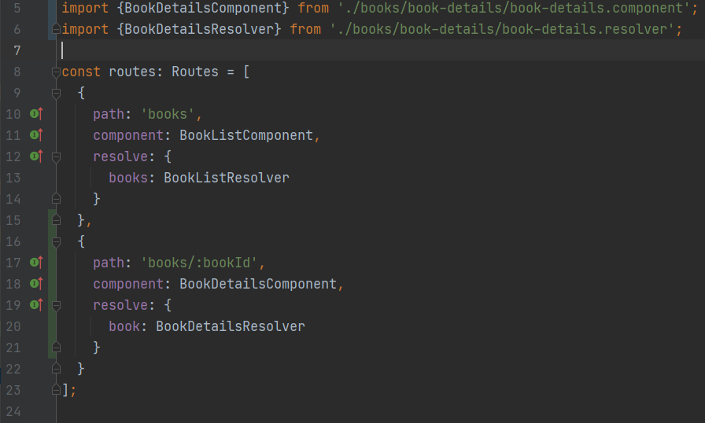

<p align="center">
  <h2 align="center">Design & Implementation of Web Systems</h2>
  <h3 align="center">Task List #5</h3>
  <p align="center">
    <a href="./README.md"><strong>README.md</strong></a>
    ·
    <a href="./Tasklist5.pdf">Tasklist5.pdf</a>
    ·
    <a href="https://luzkan.github.io/DesignAndImplementationOfWebSystems/Tasklist5/index.html">Website</a>
  </p>
</p>

<details open>
  <summary>Tasks & Summary</summary>
  <ol>
    <li>
      <a href="#task-1">Task #1</a>
      <i>Implementing Detailed Book View</i>
      <ul>
        <li>Implement `findBookById` and integrate with endpoint in backend</li>
        <li>Generate `book-details` component in `books` module</li>
        <li>Add routing in `/ui/books/{bookId}`, data in `book-details` view should  be loaded via resolver</li>
        <li>add navigation between list view and detail view (without website reloading)</li>
      </ul>
    </li>
    <li>
      <a href="#task-2">Task #2</a>
      <i>Implementing Reviews Feature</i>
      <ul>
        <li>Reviews should be displayed w/ separate component</li>
        <li>Implement separate service for reviews loading</li>
        <li>Integrate reviews with books detailed view</li>
        <li>Make reviews load independently from resolver. Add a loading-spinner with artificial delay on backend.</li>
      </ul>
    </li>
    <li>
      <a href="#task-3">Task #3</a>
      <i>Implementing Add New Review Feature</i>
      <ul>
        <li>Create new component that will manage a form through which user can add new review. It should be implemented as new view or inside `book-details` view.</li>
        <li>All fields in the form should be required</li>
        <li>Implement the review-save feature in review service</li>
        <li>After saving the new review it should be saved in the backend and the `detail-view` should be updated accordingly</li>
      </ul>
    </li>
    <li>
    <a href="#task-4">Task #4</a>
      <i>Implementing Book Deletion</i>
      <ul>
        <li>Book deletion should be performed by clicking a button in detailed book view</li>
        <li>After pressing the button there should be a pop-up w/ action confirmation</li>
        <li>Book shouldn't be deleted if any review for given book exist</li>
        <li>After successful deletion site should switch to book list view</li>
      </ul>
    </li>
  </ol>
</details>

---

## Task #1
<details>
  <summary>Implementing Detailed Book View</summary>

---

### Implementing `findBookByID`
```ts
  // File: books-rest.service.ts
  findBookById(id: string): Observable<Book> {
    return this.http.get<Book>(`/api/books/${id}`);
  }
```

### Generating `book-details` in `frontend/src/app/books`


### Generating resolver (`book-details.resolver`)


##### Implementing resolve method


##### Routing


### Adding Navigation between list-view and detail-view
##### Adding Font Awesome to the project for icons


```java
// File: app.module.ts
import { FontAwesomeModule } from '@fortawesome/angular-fontawesome';

@NgModule({
  ...
  imports: [
    ...
    FontAwesomeModule
    ...
  ],
})
```

##### Adding Info Icon to the Book Panel Component
```java
// File: book-panel.component.ts
import { faInfoCircle } from '@fortawesome/free-solid-svg-icons';

@Component({
export class BookPanelComponent implements OnInit {

  faInfoCircle = faInfoCircle;
  ...

}
```

##### Adding Link to Detail View through Font Awesome Icon
```html
<!-- File: book-panel -->
<div class="bs-data-panel">
  ...
  <a routerLink="/books/{{ book.id }}"><fa-icon [icon]="faInfoCircle"></fa-icon></a>
</div>
```

##### Verifying the result


</details>

## Task #2
<details>
  <summary>Implementing Reviews Feature</summary>

---

##### Creating Reviews Module, Component, Service and DB Model


##### DB Model


##### Adding Review Model in the component
```java
// File: review.component.ts
export class ReviewComponent implements OnInit {
  ...
  @Input()
  review: Review;
  ...
}
```

##### Review Display
```html
<div class="card" style="width: 18rem;">
  <div class="card-body">
    <h5 class="card-title title">{{review.title}}</h5>
    <h6 class="card-title author">{{review.author}}</h6>
    <h6 class="card-title rating">{{review.rating}}</h6>
    <p class="card-text content">{{review.content}}</p>
  </div>
</div>
```

##### Book Details Component implementing method for getting reviews
```java
export class BookDetailsComponent implements OnInit {

  ...
  reviews: Review[];

  constructor(private readonly route: ActivatedRoute,
              private readonly reviewService: ReviewsRestService) { }

  ngOnInit(): void {
    this.getAllReviewsForThisBook();
  }

  getAllReviewsForThisBook(): void {
    this.reviewService.findAllForBook(this.book.id).subscribe(reviews => { this.reviews = reviews; });
  }

}
```

##### Displaying the Reviews in Book Details
```html
<!-- File: book-details.component.html -->
  <div class="reviews">
    <app-review *ngFor="let review of reviews" [review]="review"> </app-review>
    <p *ngIf="!reviews || reviews.length === 0">No reviews found</p>
  </div>
}
```

##### Loading Reviews
```java
// File: reviews-rest.service.ts
export class ReviewsRestService {

  constructor(private readonly httpClient: HttpClient) { }

  findAllForBook(book: string): Observable<Review[]> {
    return this.httpClient.get<Review[]>(`/api/books/${book}/reviews`);
  }

}
```

### Loading Spinner
##### Adding Timeout
```java
// file: book-details.component.ts
...
loading: boolean = true;
...

getAllReviewsForThisBook(): void {
  this.reviewService.findAllForBook(this.book.id).subscribe(reviews => { setTimeout(() => {
        this.reviews = reviews;
        this.loading = false;
      }, 1500);
  });
}
```

##### Adjusting the new display
```html
<div class="m-4">
  <div class="row">
    <div *ngIf="loading" class="spinner-border"></div>
    <app-review *ngFor="let review of reviews" [review]="review"> </app-review>
    <p *ngIf="(!reviews || reviews.length === 0) && !loading">No reviews found</p>
  </div>
</div>
```

</details>


## Task #3
<details>
  <summary>Implementing Add New Review Feature</summary>

---

##### Generating new component: `add-review-form`


##### `add-review-form.component.ts`
```java
export class AddReviewFormComponent implements OnInit {

  form: FormGroup;
  review: Review;

  @Input()
  book: Book;

  @Output()
  reviewPostForm = new EventEmitter();

  constructor(private readonly reviewService: ReviewsRestService) { }

  ngOnInit(): void {
    this.review = {
      title: '',
      author: '',
      content: '',
      rating: 5,
      book: this.book.id
    };
    this.form = new FormGroup({author: new FormControl(this.review.author, [Validators.required])});
  }

  submitForm(displayedForm: any): void {
    this.reviewService.addNewReview(this.review).subscribe(e => {
      displayedForm.reset();
      this.reviewPostForm.emit()
    })
  }

```

##### `add-review-form.component.html`
```html
<form #displayedForm="ngForm" (ngSubmit)="submitForm(displayedForm)">
  ...
  <input type="text" class="form-control" id="inputTitle" name="title" placeholder="Title" [(ngModel)]="review.title" required>
  ...
  <input type="text" class="form-control" id="inputAuthor" name="author" placeholder="Author" [(ngModel)]="review.author" required>
  ...
  <textarea type="text" class="form-control" id="inputContent" name="content" placeholder="I think that..." [(ngModel)]="review.content" rows="3" required></textarea>
  ...
  <select id="inputRating" class="form-control" name="rating" [(ngModel)]="review.rating" required>
    <option selected>5</option>
    <option>4</option>
    <option>3</option>
    <option>2</option>
    <option>1</option>
  </select>
  ...
  <button [disabled]="displayedForm.invalid" type="submit" class="btn btn-primary">Send</button>
  ...
</form>
```

##### `book-details.component.html`
```html
...
<app-add-review-form [book]="book" (reviewPostForm)="getAllReviewsForThisBook()"></app-add-review-form>
...
```

</details>

## Task #4
<details>
  <summary>Implementing Book Deletion</summary>

---

##### `book-details.component.html`
```html
...
<div class="admin-icons">
  <button class="btn-danger" (click)="deleteThisBook()"><fa-icon [icon]="faTrashAlt"></fa-icon></button>
</div>
...
```

##### `book-details.component.ts`
```java
import {Router} from '@angular/router';
import {BooksRestService} from "../shared/services/books-rest.service";
import { faTrashAlt } from '@fortawesome/free-solid-svg-icons';
...
export class BookDetailsComponent implements OnInit {
  ...
  faTrashAlt = faTrashAlt;

  constructor(...
              private readonly bookService: BooksRestService,
              private readonly router: Router) { }

  deleteThisBook(): void {
    // Creating a request for given Book ID to check whether it has reviews
    this.reviewService.findAllForBook(this.book.id).subscribe(rev => {
      // Guard Check: Return if it does have any review
      if (rev.length !== 0) { alert('Can\'t delete this book - it has reviews!'); return; }

      // Create popup confirmation window
      if (confirm('Confirm delete')) {
          this.bookService.deleteById(this.book.id).subscribe(e => this.router.navigateByUrl('/books'));
      }
    });
  }
}
```

##### `book-details.component.ts`
```java
deleteById(id: string) {
  return this.http.delete(`/api/books/${id}`);
}
```

##### Testing deletion of a book


</details>
